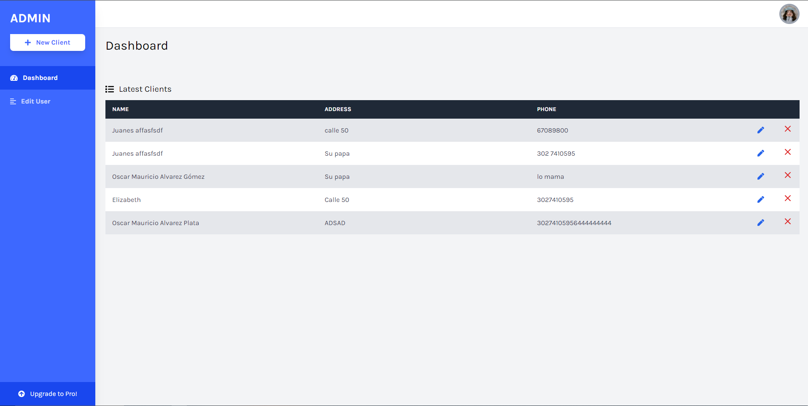

# Test project WMWISE

## Project Documentation

**Project Description: WMWISE Laravel Test**

**Project Overview:**
Create a CRUD application for clients following the specified instructions using Laravel 11.

**Requirements:**
1. Fields for clients: name, address, phone, country (selectable from database).
2. Country information should be fetched from the database.
3. Client information should be stored in a database.
4. Use Laravel Requests for request validation (optional).
5. Send an email when a client is created using events and mailables (optional).

**Development Stack:**
1. Backend: Laravel 11
2. Frontend: Blade files, Alpine.js, Vue.js, or Inertia.js (choose according to comfort).
3. Use English language for all code, including tables, columns, and codebase.

**Steps:**
1. Set up Laravel environment.
2. Create migrations for clients and countries tables with English names and columns.
3. Implement CRUD operations for clients.
4. Use Laravel Requests for request validation (optional).
5. Implement email notification using events and mailables (optional).
6. Create frontend views using Blade files with chosen frontend framework (Alpine.js, Vue.js, or Inertia.js).
7. Test and validate functionality.
8. Upload the project to GitHub.
9. Grant access to GitHub repository to karenecv and kcardenas.
10. Send the repository link to mtorres@wmwise.com and kcardenas@wmwise.com.

**Expected Completion Time:** The assigned task should be completed within 4 days after receiving this email.

## Requirements

Before you begin, make sure you have the following installed:

- PHP >= 7.4
- Composer
- Node.js and NPM
-Git

## Starting

1. Clone the repository:

    ```bash
    git clone https://github.com/miusarname2/laravel-test-CRUD.git
    ```

2. Install PHP and JavaScript dependencies:

    ```bash
    composer install
    ```

3. Copy the `.env.example` file to `.env` and configure the database environment variables.

4. Generate the application key:

    ```bash
    php artisan key:generate
    ```

5. Run the migrations and seeders:

    ```bash
    php artisan migrate --seed
    ```

6. Start the server:

    ```bash
    php artisan serve
    ```

You can now access your application at [http://localhost:8000](http://localhost:8000).
## Use

To use the application, follow the following steps:

- Access the URL [http://localhost:8000](http://localhost:8000).
- The available routes are:
   - `/clients`: Shows a panel with all clients, with options to edit and delete.
   - `/clients/create`: Allows you to create a new client.
   - `/clients/<client_id>/edit`: Allows you to edit an existing client.



### Data models

#### `clients`

```php
<?php

namespace App\Models;

use Illuminate\Database\Eloquent\Factories\HasFactory;
use Illuminate\Database\Eloquent\Model;

class Client extends Model
{


    protected $fillable = ['name', 'address', 'phone', 'country_id'];

    public function country()
    {
        return $this->belongsTo(Countries::class);
    }

}
```

#### `Countries`

```php
<?php

namespace App\Models;

use Illuminate\Database\Eloquent\Factories\HasFactory;
use Illuminate\Database\Eloquent\Model;

class Countries extends Model
{
    protected $fillable = ['name'];

    public function clients()
    {
        return $this->hasMany(Client::class);
    }
}

```

## Native Documentation

<p align="center"><a href="https://laravel.com" target="_blank"></a></p>

<p align="center">
<a href="https://github.com/laravel/framework/actions"></a>
<a href="https://packagist.org/packages/laravel/framework"></a>
<a href="https://packagist.org/packages/laravel/framework"></a>
<a href="https://packagist.org/packages/laravel/framework"></a>
</p>

## About Laravel

Laravel is a web application framework with expressive, elegant syntax. We believe development must be an enjoyable and creative experience to be truly fulfilling. Laravel takes the pain out of development by easing common tasks used in many web projects, such as:

- [Simple, fast routing engine](https://laravel.com/docs/routing).
- [Powerful dependency injection container](https://laravel.com/docs/container).
- Multiple back-ends for [session](https://laravel.com/docs/session) and [cache](https://laravel.com/docs/cache) storage.
- Expressive, intuitive [database ORM](https://laravel.com/docs/eloquent).
- Database agnostic [schema migrations](https://laravel.com/docs/migrations).
- [Robust background job processing](https://laravel.com/docs/queues).
- [Real-time event broadcasting](https://laravel.com/docs/broadcasting).

Laravel is accessible, powerful, and provides tools required for large, robust applications.

## Learning Laravel

Laravel has the most extensive and thorough [documentation](https://laravel.com/docs) and video tutorial library of all modern web application frameworks, making it a breeze to get started with the framework.

You may also try the [Laravel Bootcamp](https://bootcamp.laravel.com), where you will be guided through building a modern Laravel application from scratch.

If you don't feel like reading, [Laracasts](https://laracasts.com) can help. Laracasts contains over 2000 video tutorials on a range of topics including Laravel, modern PHP, unit testing, and JavaScript. Boost your skills by digging into our comprehensive video library.

## Laravel Sponsors

We would like to extend our thanks to the following sponsors for funding Laravel development. If you are interested in becoming a sponsor, please visit the Laravel [Patreon page](https://patreon.com/taylorotwell).

### Premium Partners

- **[Vehikl](https://vehikl.com/)**
- **[Tighten Co.](https://tighten.co)**
- **[Kirschbaum Development Group](https://kirschbaumdevelopment.com)**
- **[64 Robots](https://64robots.com)**
- **[Cubet Techno Labs](https://cubettech.com)**
- **[Cyber-Duck](https://cyber-duck.co.uk)**
- **[Many](https://www.many.co.uk)**
- **[Webdock, Fast VPS Hosting](https://www.webdock.io/en)**
- **[DevSquad](https://devsquad.com)**
- **[Curotec](https://www.curotec.com/services/technologies/laravel/)**
- **[OP.GG](https://op.gg)**
- **[WebReinvent](https://webreinvent.com/?utm_source=laravel&utm_medium=github&utm_campaign=patreon-sponsors)**
- **[Lendio](https://lendio.com)**

## Contributing

Thank you for considering contributing to the Laravel framework! The contribution guide can be found in the [Laravel documentation](https://laravel.com/docs/contributions).

## Code of Conduct

In order to ensure that the Laravel community is welcoming to all, please review and abide by the [Code of Conduct](https://laravel.com/docs/contributions#code-of-conduct).

## Security Vulnerabilities

If you discover a security vulnerability within Laravel, please send an e-mail to Taylor Otwell via [taylor@laravel.com](mailto:taylor@laravel.com). All security vulnerabilities will be promptly addressed.

## License

The Laravel framework is open-sourced software licensed under the [MIT license](https://opensource.org/licenses/MIT).
